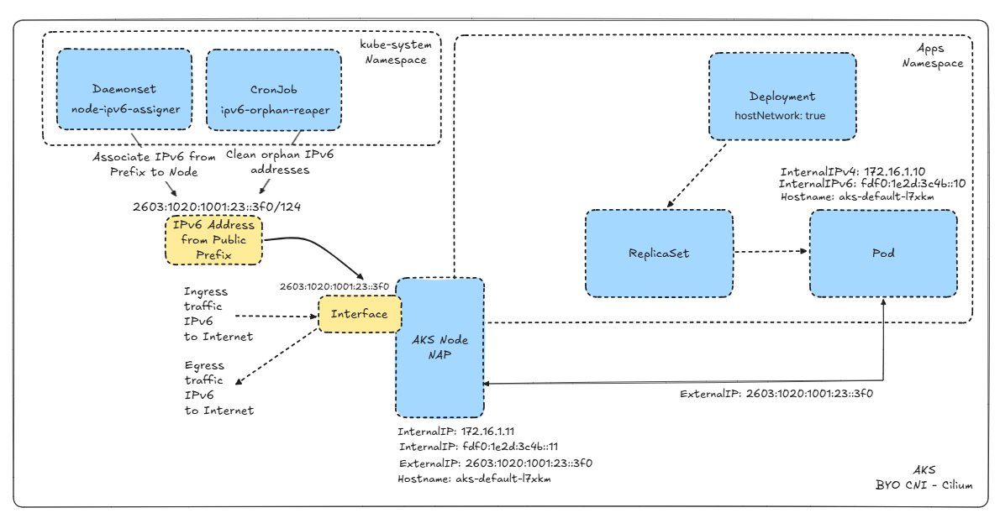

# AKS NAP IPv6 with BYO CNI Cilium

Automated public IPv6 address lifecycle management for Azure Kubernetes Service (AKS) clusters running **Node Auto-Provisioning (NAP / Karpenter)** with **Bring-Your-Own CNI Cilium** in a dual-stack network.

## Problem Statement

AKS clusters using NAP (Karpenter) dynamically provision and deprovision nodes to match workload demand. When these clusters operate in a dual-stack (IPv4 + IPv6) environment with BYO CNI Cilium, there is no built-in mechanism to automatically assign public IPv6 addresses to newly provisioned nodes. Additionally, when nodes are drained and removed, their associated IPv6 public IP resources can become orphaned, leading to resource leaks and cost waste.

This solution provides a fully automated, Kubernetes-native approach to:

1. **Assign** a public IPv6 address (from an Azure Public IP Prefix) to every new NAP node as it joins the cluster.
2. **Clean up** orphaned IPv6 public IPs when nodes are decommissioned.

## Architecture



The solution consists of two Kubernetes workloads deployed in the `kube-system` namespace and an application workload in a separate namespace:

| Component | Kind | Namespace | Purpose |
|---|---|---|---|
| `node-ipv6-assigner` | DaemonSet | `kube-system` | Runs on every NAP node; authenticates via **Azure Workload Identity** and assigns a public IPv6 from an Azure Public IP Prefix to the node's NIC |
| `ipv6-orphan-reaper` | CronJob | `kube-system` | Runs hourly; authenticates via **Azure Workload Identity** and scans for and deletes orphaned IPv6 public IPs tagged with `managedBy=ipv6-assigner` |
| `nginx-hostnet` | Deployment | `nginx-demo` | Sample `hostNetwork: true` application used to validate end-to-end IPv6 connectivity |

### How It Works

1. **Node joins the cluster** — NAP provisions a new VM and Kubernetes schedules the DaemonSet pod onto it.
2. **DaemonSet pod starts** — The `node-ipv6-assigner` pod authenticates via Azure Workload Identity, queries the Azure Instance Metadata Service (IMDS) for the VM name and resource group, then:
   - Looks for an existing Public IP Prefix (`aks-ipv6-prefix-N`). If the current prefix is full (`/124` = 16 addresses), a new prefix is created automatically.
   - Creates a `Standard SKU` IPv6 Public IP from the prefix and tags it `managedBy=ipv6-assigner`.
   - Adds an `ipconfig-v6` secondary IP configuration to the node's NIC, binding the public IPv6 address.
3. **Node becomes externally reachable over IPv6** — Kubernetes reports the IPv6 as `ExternalIP` on the node object. Pods running with `hostNetwork: true` can send and receive IPv6 traffic directly.
4. **Node is removed** — When NAP drains and deletes a node, the NIC is detached but the Public IP resource may persist. The `ipv6-orphan-reaper` CronJob runs every hour, finds IPs with tag `managedBy=ipv6-assigner` that have no `ipConfiguration` association, and deletes them.

### Traffic Flow

```
Internet (IPv6)
      │
      ▼
Public IPv6 (from Prefix)  ──►  Node NIC (ipconfig-v6)  ──►  Pod (hostNetwork: true)
      ▲
      │
Egress IPv6 traffic from Pod uses the same public IPv6 as source address
```

## Prerequisites

- Azure CLI (`az`) installed and authenticated
- `kubectl` configured for your cluster
- `helm` v3 installed
- An Azure subscription with permissions to create resources
- A dual-stack VNet and Subnet (IPv4 + IPv6 address spaces)

## Deployment Guide

### Step 1 — Create Network Infrastructure and AKS Cluster

Set up a dual-stack VNet, subnet, managed identity, and an AKS cluster with NAP and BYO CNI:

```bash
# Variables
LOCATION="swedencentral"
RG="customer-cilium-rg"
VNET="customer-cilium-vnet"
SUBNET="customer-cilium-snet-aks"
VNET_V4="172.16.0.0/16"
VNET_V6="fdf0:1e2d:3c4b::/48"
SUBNET_V4="172.16.1.0/24"
SUBNET_V6="fdf0:1e2d:3c4b::/64"
CLUSTER_NAME="customer-cilium-aks"
IDENTITY_NAME="customer-cilium-aks-mi"

# Resource Group
az group create --name $RG --location $LOCATION

# Dual-Stack VNet
az network vnet create \
    --resource-group $RG \
    --name $VNET \
    --address-prefixes $VNET_V4 $VNET_V6

# Dual-Stack Subnet
az network vnet subnet create \
    --resource-group $RG \
    --vnet-name $VNET \
    --name $SUBNET \
    --address-prefixes $SUBNET_V4 $SUBNET_V6

SUBNET_ID=$(az network vnet subnet show -g "$RG" --vnet-name "$VNET" -n "$SUBNET" --query id -o tsv)

# Managed Identity for AKS
az identity create -g "$RG" -n "$IDENTITY_NAME" -l "$LOCATION"

SUBSCRIPTION_ID=$(az account show --query id -o tsv)
IDENTITY_ID="/subscriptions/$SUBSCRIPTION_ID/resourceGroups/$RG/providers/Microsoft.ManagedIdentity/userAssignedIdentities/$IDENTITY_NAME"
IDENTITY_PRINCIPAL_ID=$(az identity show --resource-group $RG --name $IDENTITY_NAME --query principalId -o tsv)

az role assignment create \
    --scope "/subscriptions/$SUBSCRIPTION_ID/resourceGroups/$RG/providers/Microsoft.Network/virtualNetworks/$VNET" \
    --role "Network Contributor" \
    --assignee $IDENTITY_PRINCIPAL_ID

# AKS Cluster with NAP and BYO CNI (network-plugin=none)
POD_CIDR_V4="10.244.0.0/16"
SVC_CIDR_V4="10.0.0.0/16"
DNS_IP_V4="10.0.0.10"

az aks create \
    --resource-group $RG \
    --name $CLUSTER_NAME \
    --location $LOCATION \
    --vnet-subnet-id "$SUBNET_ID" \
    --assign-identity "$IDENTITY_ID" \
    --network-plugin none \
    --enable-managed-identity \
    --ip-families ipv4 \
    --node-provisioning-mode Auto \
    --nodepool-name "system" \
    --pod-cidrs "$POD_CIDR_V4" \
    --service-cidrs "$SVC_CIDR_V4" \
    --dns-service-ip "$DNS_IP_V4" \
    --node-count 1 \
    --generate-ssh-keys

az aks get-credentials --resource-group $RG --name $CLUSTER_NAME --overwrite-existing

# Taint system pool to keep workloads on NAP nodes
az aks nodepool update \
    -g "$RG" \
    -n "system" \
    --cluster-name "$CLUSTER_NAME" \
    --node-taints CriticalAddonsOnly=true:NoSchedule
```

> **Note:** Nodes will show `NotReady` until Cilium is installed in the next step.

### Step 2 — Install Cilium CNI

```bash
helm repo add cilium https://helm.cilium.io/
helm repo update

API_SERVER_IP=$(kubectl get endpoints kubernetes -o jsonpath='{.subsets[0].addresses[0].ip}')

helm install cilium cilium/cilium --version 1.19.1 \
    --namespace kube-system \
    --set ipv4.enabled=true \
    --set ipv6.enabled=true \
    --set enableIPv6Masquerade=true \
    --set kubeProxyReplacement=true \
    --set dnsproxy.enabled=true \
    --set localRedirectPolicies.enabled=true \
    --set k8sServiceHost=$API_SERVER_IP \
    --set k8sServicePort=443 \
    --set aksbyocni.enabled=true \
    --set hubble.ui.enabled=true \
    --set hubble.relay.enabled=true \
    --set operator.replicas=2
```

After installation, nodes should transition to `Ready`:

```
$ kubectl get nodes -o wide
NAME                             STATUS   ROLES    AGE   VERSION   INTERNAL-IP   EXTERNAL-IP   OS-IMAGE
aks-default-grbj5                Ready    <none>   5m    v1.33.7   172.16.1.8    <none>        Ubuntu 22.04.5 LTS
aks-system-40454228-vmss000000   Ready    <none>   53m   v1.33.7   172.16.1.4    <none>        Ubuntu 22.04.5 LTS
```

### Step 3 — Apply Cilium DNS Redirect Policy

`hostNetwork: true` pods resolve DNS through the Azure DNS wire server (`168.63.129.16`). This policy redirects that traffic to node-local CoreDNS for proper in-cluster resolution:

```bash
kubectl apply -f nap-with-byo-cni-cilium/cilium-dns-policy.yaml
```

If the `CiliumLocalRedirectPolicy` CRD is missing:

```bash
kubectl apply -f https://raw.githubusercontent.com/cilium/cilium/refs/heads/main/pkg/k8s/apis/cilium.io/client/crds/v2/ciliumlocalredirectpolicies.yaml
```

### Step 4 — Deploy the IPv6 Manager

#### 4.1 — Enable Workload Identity on the Cluster

```bash
az aks update -g $RG -n $CLUSTER_NAME \
    --enable-oidc-issuer \
    --enable-workload-identity
```

#### 4.2 — Create a Managed Identity for IPv6 Management

```bash
IPV6_IDENTITY_NAME="ipv6-manager-identity"

az identity create --name $IPV6_IDENTITY_NAME --resource-group $RG --location $LOCATION

USER_ASSIGNED_CLIENT_ID=$(az identity show --name $IPV6_IDENTITY_NAME --resource-group $RG --query clientId -o tsv)
USER_ASSIGNED_PRINCIPAL_ID=$(az identity show --name $IPV6_IDENTITY_NAME --resource-group $RG --query principalId -o tsv)
```

#### 4.3 — Grant Network Permissions

The identity needs `Network Contributor` on both the node resource group (where NICs and Public IPs live) and the main resource group (where the VNet/Subnet lives):

```bash
NODE_RG=$(az aks show -g $RG -n $CLUSTER_NAME --query nodeResourceGroup -o tsv)

# Node Resource Group — create/manage Public IPs and NIC IP configs
az role assignment create --role "Network Contributor" \
    --assignee-object-id $USER_ASSIGNED_PRINCIPAL_ID \
    --assignee-principal-type "ServicePrincipal" \
    --scope "/subscriptions/$SUBSCRIPTION_ID/resourceGroups/$NODE_RG"

# Main Resource Group — reference VNet/Subnet when creating IP configs
az role assignment create --role "Network Contributor" \
    --assignee-object-id $USER_ASSIGNED_PRINCIPAL_ID \
    --assignee-principal-type "ServicePrincipal" \
    --scope "/subscriptions/$SUBSCRIPTION_ID/resourceGroups/$RG"
```

#### 4.4 — Create Federated Credential

```bash
AKS_OIDC_ISSUER="$(az aks show -n $CLUSTER_NAME -g $RG --query "oidcIssuerProfile.issuerUrl" -o tsv)"

az identity federated-credential create --name "ipv6-manager-fed" \
    --identity-name $IPV6_IDENTITY_NAME \
    --resource-group $RG \
    --issuer "${AKS_OIDC_ISSUER}" \
    --subject "system:serviceaccount:kube-system:ipv6-manager-sa" \
    --audience api://AzureADTokenExchange
```

#### 4.5 — Update and Apply Kubernetes Manifests

Update the `service-account.yaml` with your Client ID:

```yaml
# ipv6-nap-manager/service-account.yaml
annotations:
  azure.workload.identity/client-id: "<USER_ASSIGNED_CLIENT_ID>"
```

Update the `cronjob.yaml` with your node resource group:

```yaml
# ipv6-nap-manager/cronjob.yaml
env:
- name: NODE_RG
  value: "<MC_resourcegroup_cluster_location>"
```

Apply all manifests:

```bash
kubectl apply -f ipv6-nap-manager/service-account.yaml
kubectl apply -f ipv6-nap-manager/configmap.yaml
kubectl apply -f ipv6-nap-manager/daemonset.yaml
kubectl apply -f ipv6-nap-manager/cronjob.yaml
```

### Step 5 — Validate

Deploy the sample `hostNetwork` nginx application:

```bash
kubectl apply -f nap-with-byo-cni-cilium/cilium-app.yaml
```

Scale the deployment to trigger NAP to provision additional nodes:

```bash
kubectl scale deployment nginx-hostnet -n nginx-demo --replicas=17
```

After nodes are provisioned, verify that each NAP node has an IPv6 `ExternalIP`:

```
$ kubectl get nodes -o wide
NAME                STATUS   ROLES   AGE   VERSION   INTERNAL-IP   EXTERNAL-IP              OS-IMAGE
aks-default-47vwq   Ready    <none>  16m   v1.33.7   172.16.1.19   2603:1020:1001:23::3ff   Ubuntu 22.04.5 LTS
aks-default-4czpm   Ready    <none>  17m   v1.33.7   172.16.1.7    2603:1020:1001:23::3f3   Ubuntu 22.04.5 LTS
aks-default-dnbhg   Ready    <none>  18m   v1.33.7   172.16.1.5    2603:1020:1001:23::3f2   Ubuntu 22.04.5 LTS
...
```

Scale back down and verify orphan cleanup:

```bash
kubectl scale deployment nginx-hostnet -n nginx-demo --replicas=2
```

The `ipv6-orphan-reaper` CronJob will clean up orphaned IPs on its next hourly run. Check cron job logs:

```
$ kubectl logs -n kube-system job/ipv6-orphan-reaper-<id>
[Sat Mar  7 20:55:46 UTC 2026] RESOURCE FOUND:
  NAME: pip-v6-aks-default-qlm9l
  IP:   2603:1020:1001:23::3fa
[Sat Mar  7 20:55:46 UTC 2026] Action: Attempting deletion of pip-v6-aks-default-qlm9l...
[Sat Mar  7 20:55:58 UTC 2026] Result: Successfully deleted pip-v6-aks-default-qlm9l.
```

## Repository Structure

```
├── README.md                              # This file
├── docs/
│   └── architecture.png                   # Architecture diagram
├── ipv6-nap-manager/                      # IPv6 lifecycle management components
│   ├── service-account.yaml               # ServiceAccount with Workload Identity annotation
│   ├── configmap.yaml                     # Shell script for IPv6 assignment logic
│   ├── daemonset.yaml                     # DaemonSet — runs on every NAP node
│   ├── cronjob.yaml                       # CronJob — hourly orphan IP cleanup
│   └── readme.md                          # Detailed setup instructions
└── nap-with-byo-cni-cilium/              # AKS + Cilium setup and sample app
    ├── cilium-app.yaml                    # Sample nginx hostNetwork deployment
    ├── cilium-dns-policy.yaml             # CiliumLocalRedirectPolicy for DNS
    └── readme.md                          # Detailed setup instructions
```

## Key Design Decisions

| Decision | Rationale |
|---|---|
| **DaemonSet over Operator** | Each pod runs on its own node with access to IMDS, making identity and metadata resolution straightforward without cross-node API calls |
| **Public IP Prefixes (`/124`)** | Groups up to 16 IPv6 addresses per prefix; automatic overflow to new prefixes ensures seamless scaling beyond 16 nodes |
| **Tag-based orphan detection** | IPs tagged `managedBy=ipv6-assigner` with no `ipConfiguration` are reliably identified as orphaned — safe and deterministic cleanup |
| **Workload Identity** | No secrets stored in the cluster; Azure AD federated tokens provide secure, short-lived access to Azure APIs |
| **`hostNetwork: true` for apps** | Required for pods to use the node's IPv6 address directly for ingress/egress; anti-affinity ensures one pod per node |
| **CiliumLocalRedirectPolicy** | `hostNetwork` pods resolve DNS via Azure's wire server (`168.63.129.16`); this policy redirects to node-local CoreDNS for proper in-cluster DNS resolution |

## Authentication Model

```
┌──────────────────┐     Federated Token     ┌────────────────────────┐
│  Kubernetes SA   │ ──────────────────────►  │  Azure Managed Identity │
│  ipv6-manager-sa │                          │  ipv6-manager-identity  │
└──────────────────┘                          └────────────────────────┘
                                                        │
                                    Network Contributor  │  Reader
                                                        ▼
                                              ┌──────────────────┐
                                              │  Node RG (MC_*)  │
                                              │  Main RG         │
                                              └──────────────────┘
```

## Troubleshooting

| Symptom | Check |
|---|---|
| Nodes show `NotReady` | Cilium not installed or pods crashing — `kubectl get pods -n kube-system -l app.kubernetes.io/name=cilium` |
| No `ExternalIP` on NAP node | DaemonSet pod logs — `kubectl logs -n kube-system -l app=ipv6-assigner` |
| Azure auth errors in pods | Verify federated credential, OIDC issuer, and `azure.workload.identity/client-id` annotation on the ServiceAccount |
| Prefix creation fails | Check identity has `Network Contributor` on the node resource group (`MC_*`) |
| Orphaned IPs not cleaned | Check CronJob schedule and logs — `kubectl get cronjobs -n kube-system` |
| DNS resolution fails in `hostNetwork` pods | Ensure `CiliumLocalRedirectPolicy` is applied — `kubectl get ciliumlocalredirectpolicies -n kube-system` |

## License

This project is licensed under the MIT License — see the [LICENSE](LICENSE) file for details.
